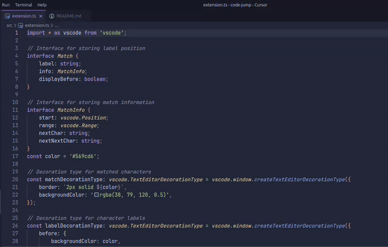
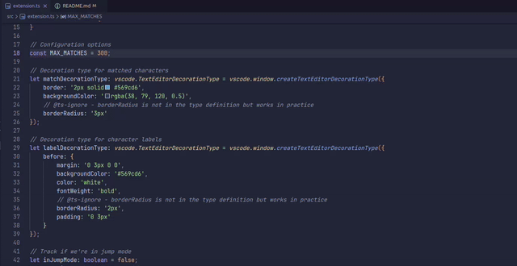
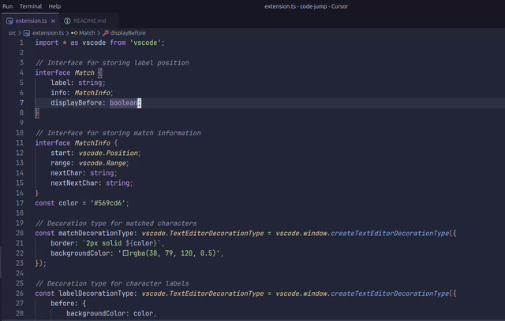

# Code Jump

Jump to any visible code in VS Code using character labels, inspired by AceJump/EasyMotion.

## Motivation

While several navigation extensions exist for VS Code, Code Jump aims to closely replicate the fluid and intuitive experience of AceJump from JetBrains IDEs. Additionally, it features enhanced backspace handling for a smoother workflow.

## Features

- Quick cursor navigation without using the mouse
- Each match gets a unique character label that you can press to jump directly to that location
- Characters are chosen for labels in order of ease of pressing
- Smart label generation that avoids using characters that conflict with the next character in target text
- Supports backspacing when searching and typing labels
- Integrates powerfully with vim visual mode, allowing selections to be extended to presize locations

## Usage

1. By default, press `Ctrl+;` (or `Cmd+;` on Mac) to activate Code Jump
2. Type characters to highlight matches
3. Type the displayed label to jump to that position
4. By default, press `Ctrl+;` (or `Cmd+;` on Mac) or simply `Escape` to exit Code Jump mode

## Configuration

1. Modify `code-jump.startJump` keybinding for entering jump mode.
2. Modify `code-jump.escapeJumpMode` keybinding for exiting jump mode.

## Demos

- Type as many characters of target without conflicting with a label

  

- Uses 2 character labels when necessary, and narrows search after first character is pressed

  

- Supports backspacing before and after partially matching a label

  

## Requirements

- VS Code 1.60.0 or higher

## Known Issues

Please report any bugs or feature requests on the [GitHub repository](https://github.com/OxideOps/code-jump/issues).

## Development

- Run `npm install` to install dependencies
- Press `F5` to start debugging

## License

MIT 