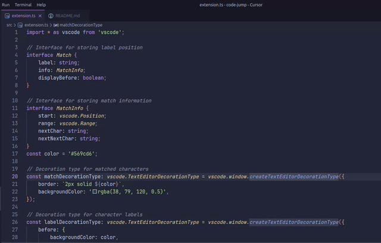

# Code Jump

Jump to any visible text in VS Code using character labels, inspired by AceJump/EasyMotion.

## Motivation

While several navigation extensions exist for VS Code, Code Jump aims to closely replicate the fluid and intuitive experience of AceJump from JetBrains IDEs, but with additional support for backspacing during jump mode.

## Usage

1. By default, press `Ctrl+;`/`Cmd+;` to activate Code Jump
2. Type characters to highlight matches
3. Type the displayed label to jump to that position
4. By default, press `Ctrl+;`/`Cmd+;` or simply `Escape` to exit Code Jump mode

## Features

- Each match gets a unique character label that you can press to jump directly to that location
- Characters are chosen for labels in order of ease of pressing
- Smart label generation that avoids using characters that conflict with the next character in target text
- Supports backspacing when searching and typing labels
- Integrates powerfully with vim visual mode, allowing selections to be extended to precise locations
- Optionally insert labels inline with text to avoid labels covering possible matches

## Configuration

### Keybindings

By default, Code Jump uses `Ctrl`/`Cmd+;` for both entering and exiting jump mode. You can customize these keybindings:

1. Open VS Code Command Palette (`Ctrl+Shift+P` / `Cmd+Shift+P`)
2. Type "Preferences: Open Keyboard Shortcuts" and select it
3. Search for "Code Jump" to find and modify the keybindings:
   - **Code Jump: Start Jump**
   - **Code Jump: Exit Jump Mode**

### Settings

Configure Code Jump behavior through VS Code settings:

1. Open VS Code settings (`Ctrl+,` / `Cmd+,`)
2. Search for "code-jump" or modify your `settings.json` directly

#### Inline Labels
Display jump labels inline with the text rather than overlaid on top of it

```json
{
  "code-jump.inlineLabels": true
}
```

#### Decoration Color
Color used for jump labels and highlights

```json
{
  "code-jump.decorationColor": "#ff6600"
}
```

## Demos

- Type as many characters of target without conflicting with a label

  

- Uses 2 character labels when necessary, and narrows search after first character is pressed

  

- Supports backspacing before and after partially matching a label

  

- Can optionally insert labels inline with text to avoid labels covering possible matches

  

## Requirements

- VS Code 1.44.0 or higher

## Issues

Please report any bugs or feature requests on the [GitHub repository](https://github.com/OxideOps/code-jump/issues).

## Development

- Run `npm install` to install dependencies
- Press `F5` to start debugging

## License

GPL 3.0
